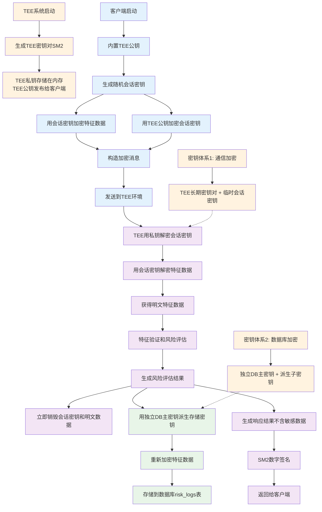

# 🔐 改进后的密钥协商与使用流程图



## 🔑 改进方案核心要点

### **1. 密钥体系完全分离**
```
通信密钥体系:
├── TEE长期密钥对 (SM2)
│   ├── TEE私钥: 仅存储在TEE内存中
│   └── TEE公钥: 客户端内置，用于加密会话密钥
└── 会话密钥 (SM4)
    ├── 客户端随机生成
    ├── 单次请求有效
    └── 用后即焚

数据库密钥体系:
├── 独立主密钥: DB_MASTER_KEY (环境变量)
├── 派生子密钥: 
│   ├── derive_key("db_user_data")
│   ├── derive_key("db_risk_logs")
│   └── derive_key("db_feature_history")
└── 加密算法: SM4-ECB + SM3完整性校验
```

### **2. 数据流程安全保证**

| 阶段 | 数据状态 | 密钥使用 | 安全措施 |
|------|---------|---------|---------|
| **客户端** | 明文特征 → 加密特征 | 随机会话密钥 | 不存储私钥 |
| **传输** | 双重加密消息 | TEE公钥保护 | 防窃听/篡改 |
| **TEE处理** | 临时明文处理 | 会话密钥解密 | 处理后立即清理 |
| **数据库存储** | 重新加密数据 | 独立DB密钥 | 与通信密钥隔离 |

### **3. 关键安全改进**

#### ✅ **前向安全性 (Forward Secrecy)**
- 每次请求使用新的随机会话密钥
- 历史会话密钥泄露不影响其他通信

#### ✅ **密钥隔离 (Key Isolation)**
- 通信密钥泄露 ≠ 数据库密钥泄露
- 数据库密钥泄露 ≠ 通信密钥泄露

#### ✅ **最小权限原则 (Least Privilege)**
- 客户端: 只有TEE公钥
- TEE: 临时持有解密密钥
- 数据库: 只有存储加密数据

#### ✅ **自动安全清理**
- TEE处理完成后立即清理所有明文数据
- 会话密钥用完即焚，不留痕迹

### **4. 实现要点**

```python
# 客户端加密流程
def client_encrypt(features, tee_public_key):
    session_key = generate_random_key()  # 生成随机会话密钥
    encrypted_features = sm4_encrypt(features, session_key)
    encrypted_session_key = sm2_encrypt(session_key, tee_public_key)
    return {
        'encrypted_features': encrypted_features,
        'encrypted_session_key': encrypted_session_key
    }

# TEE解密处理流程  
def tee_process(encrypted_message, tee_private_key):
    session_key = sm2_decrypt(encrypted_message['encrypted_session_key'], tee_private_key)
    features = sm4_decrypt(encrypted_message['encrypted_features'], session_key)
    
    # 风险评估处理
    result = risk_assessment(features)
    
    # 立即销毁敏感数据
    secure_delete(session_key, features)
    
    # 用独立密钥存储到数据库
    db_encrypted = db_encrypt(features, DB_MASTER_KEY)
    store_to_database(db_encrypted, result)
    
    return result

# 数据库独立加密
def db_encrypt(data, db_master_key):
    db_key = derive_key(db_master_key, "db_risk_logs")
    return sm4_encrypt(data, db_key)
```

这个改进方案彻底解决了当前系统密钥混用的安全隐患，实现了真正的分层安全保护！ 